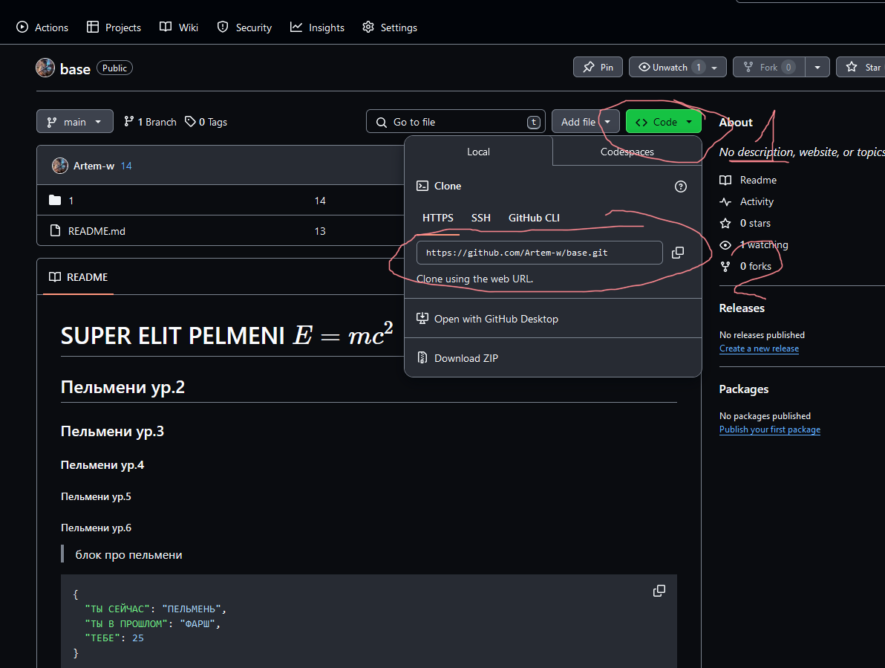

Инструкция по выполнению задания в обсидиан
- установить обсидиан(https://obsidian.md/)
- установить саблайн(https://www.sublimemerge.com/download)
- окрыть саблайм и клонировать репозиторий

- открыть клонированный репозиторий в обсидиан

- открыть настройки обсидиан -> файлы и ссылки -> отключить пункт вики ссылки(левый нижний угл)
- выполнять задание 4 не забывая указавать папку в URL в папку с изображениями
- после внесения изменений открыть сублиме мерге(stage- загрузка, можно загружать отдельные файлы(выборочно))

- После надо сделать commit messege(название изменения)
- После чего нужно запушить(push(F8)) загрузить на сервер гит хаба